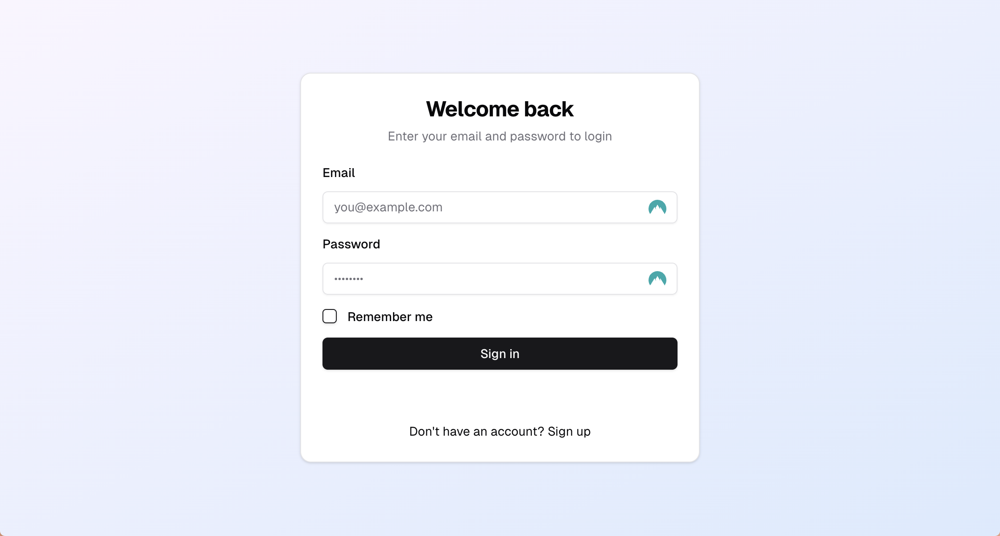
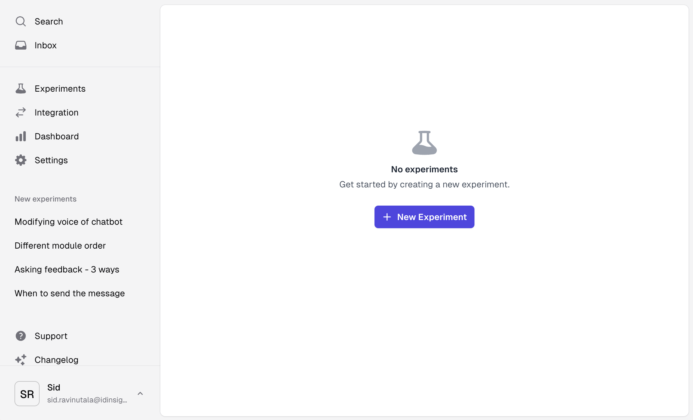
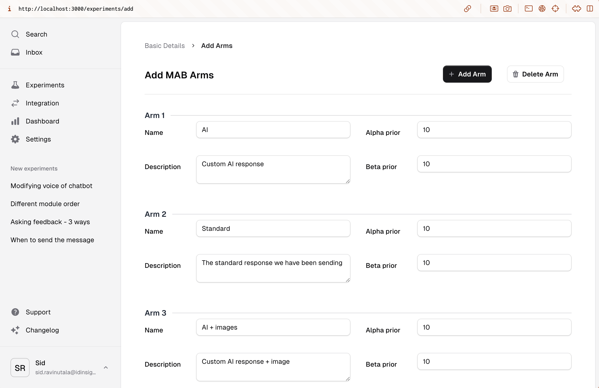
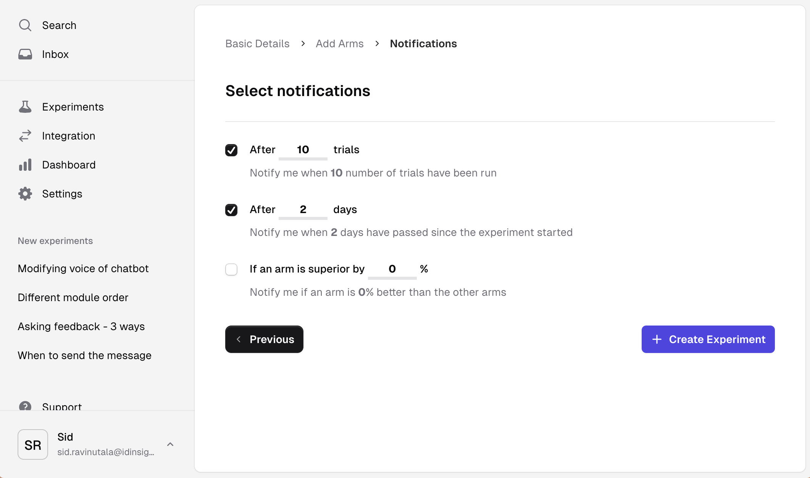
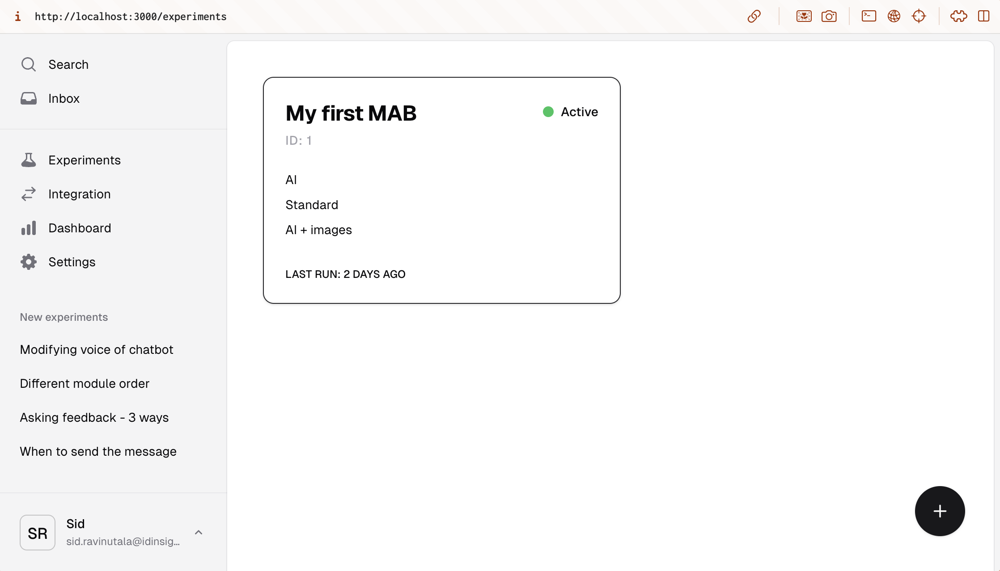

# Create an experiment

## Log in to the application

If you have deployed the docker containers locally as per the instructions [here](../deploying.md), you should see a login screen when you navigate to `https://localhost/`

The credentials are what you set in your `.backend.env` file.

## Create an experiment

Once you have logged in, you should see a screen like this:

Click on the `+ New Experiment` button to create a new experiment.

## Fill out the experiment details

Enter the details for the experiment. Both `Experiment Name` field and `Description` are mandatory. Select `MAB` as the experiment type.

Click on the `Next` button to proceed.

## Create experiment arms

Click on the `+ Add Arm` button to add arms to the experiment. You can add as many arms as you like but must have a minimum of 2 arms.

Enter details for each arm. The `Name` and `Description` fields are both mandatory. You can also change the prior (1) for the arms.
{ .annotate }

1. This MAB is using Thompson Sampling. The priors are defined through the `alpha` and `beta` parameters of the Beta distribution. The default values are `1` and `1` respectively. The higher the values, the more certain the arm is. The probability of success of the arm is calculated as `alpha / (alpha + beta)`.   Side note: We realize this is not intuitive for the non-statistician. Look out for a visual way to set the priors in the future.

Click on the `Next` button to proceed.

## Set notifications

You can select events when you should be notified. Let's select the first two and set values as in the image below.

Click on the `+ Create Experiment` to create the experiment.

## Experiment created

You will be taken to the home page where you can see the details of the experiment and the arms you created.

Now we are ready to integrate this with your application. Go to [Integrate with your application](./integrate.md) to see how to do that.
