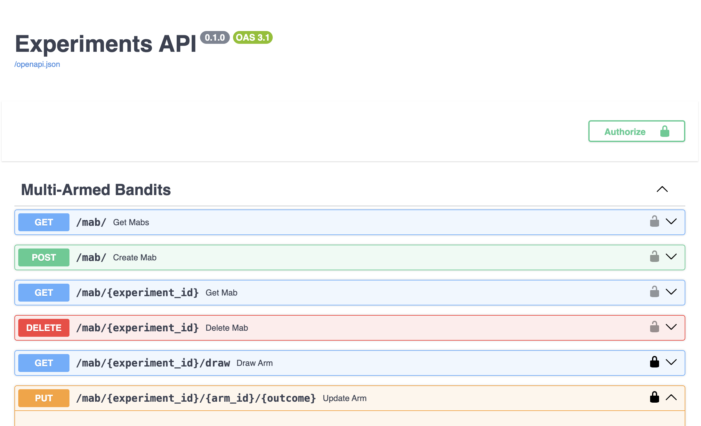

# Integrate with your app

## Go to the Integration page

Once you have [created an experiment](./create.md), you can integrate it with your app. Click on __Integration__ in the menu to get to this page

## Create a new key

Click on "Recreate Key" to create a new key. You should see a new key appear as per the image below

This key is used to authenticate your app with the API. You should keep it secret and not share it with anyone. This is the only time you will see this key, so make sure to copy it somewhere safe.

## Test out the endpoints

You can now use Swagger to test out the API endpoints. Go to `https://localhost/api/docs` to see the Swagger UI. You will need to enter the key you just created to authenticate.

